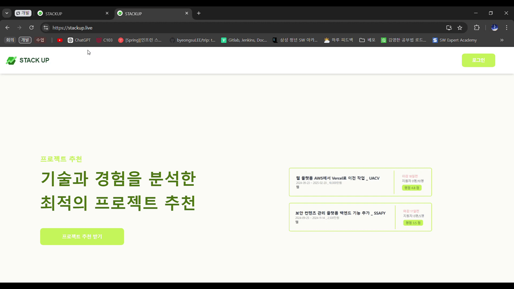
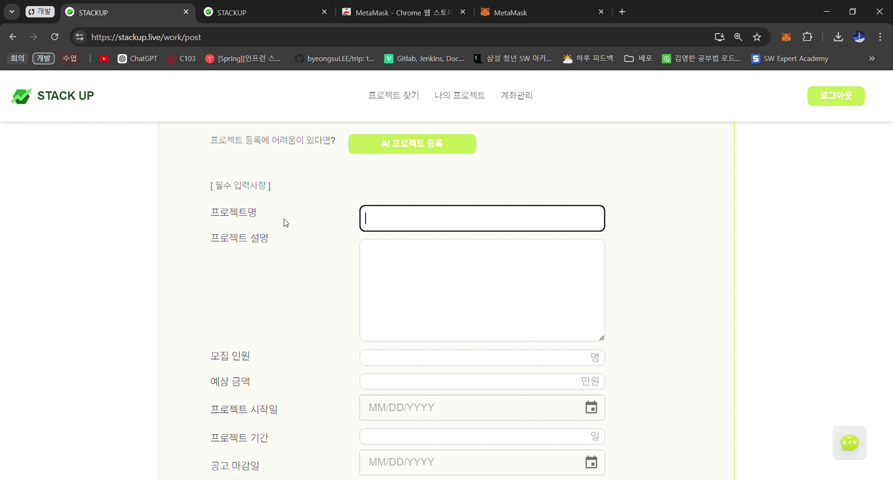
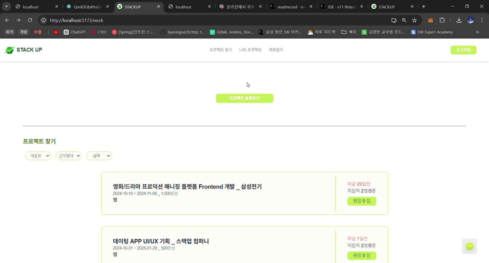

# 💼 Stack Up
### 개발자 프리랜서를 위한 종합 금융 서비스

 
## STACKUP 팀원 소개 🌱

| **최승호(팀장) [CI/CD]**                                                                                                           | **이호영** [FE]                                                                                  | **이채연** [FE]                              |
|-------------------------------------------------------------------------------------------------------------------------------|-----------------------------------------------------------------------------------------------|-------------------------------------------|
  | 온프레미스, GKE 쿠버네티스 구축 Mysql, Redis 클러스터링 ArgoCD, Jenkins, GitOps 기반 배포 MSA 설계 및 구현 Mattermost 웹훅 실시간 빌드 알림  | 프론트 디자인   NFT 발행   지갑 연결 및 생성                                                        | 프론트 통신 담당   NFT 경력 및 계약서 증명    PDF 파일 생성 |
| **김연지 [BE/FE]**                                                                                                               | **이병수 [BE]**                                                                                  | **전지훈 [FE/ML]**                              |
| 채팅 구현   Kafka 통신   프로젝트 추천   프로젝트 모집글 AI 자동 생성   백엔드 통신 및 서비스 구현                                                      |백엔드 MSA 설계 및 분리   백엔드 통신 및 서비스 구현   Github 소셜 로그인    | 서비스 기획 및 설계   발표 및 ppt 제작   이상거래탐지 ml   채팅 구현   프로젝트 추천 구현 |

## 프로젝트 소개
#### 기간 : 2024.08.09 ~ 2024.10.11 (약 7주)

## 기술 스택 & 버전 정보

### Common

1. 이슈 관리: 
2. 형상 관리: 
3. 커뮤니케이션:  

### BackEnd

  

- IntelliJ : 2024.1.4
- SpringBoot: 3.3.2
  - Project Metadata
    - Group:  com.ssafy
    - Artifact: stackup
    - Name: stackup
    - Package Name: com.ssafy.stackup
- JDK : openjdk 17.0.10 2024-01-16 LTS
- MySQL:  mysql  Ver 9.0.1
- Spring Data JPA: 3.3.2
- Spring Security: 3.3.2
- Redis: 3.3.2
- JWT: 0.11.5
- S3: 1.12.261
- ElasticSearch : 3.3.2
- Apache Kafka : 3.2.3
- oauth2 : 9.34.4

### FrontEnd

- Visual Studio Code: 1.91.1
- Node.JS: 20.12.2
- npm: 10.5.0
- WebPack
- REACT: 18.3.1
- Zustand: 4.5.4
- TailwindCSS: 3.4.8
- Figma
- OpenVidu: 2.30
- DaisyUI: 4.12.10

### CI/CD

 
- GitLab: 17.0.5
- Jenkins: **2.470**
- Nginx: 1.27.0
- Docker: 27.1.1
- ArgoCD: ArgoCD Enterprise v2.12.3
- Mattermost: Mattermost Enterprise Edition 8.x 

### WAS

- GK
- EC2:
- CertBot: 0.40.0

## 개요🌱

1. **프리랜서 맞춤 프로젝트 추천**

2. **AI 기반 프로젝트 자동 등록**

3. **프로젝트 이상거래 탐지**

4. **NFT를 이용한 계약 및 경력 증명**

5. **쿠버네티스를 이용한 재난 방지 및 고가용성**

6. **금융 및 유저 서비스를 분리한 MSA 아키텍처**
